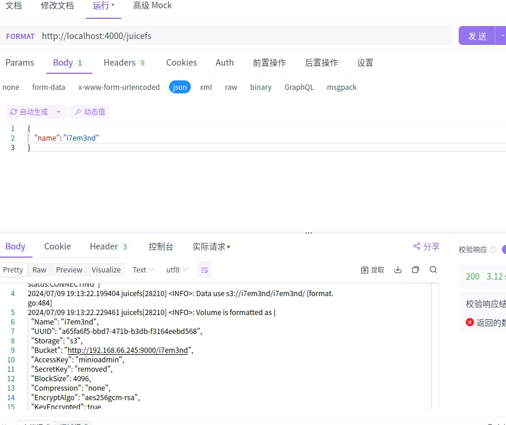

# 表格控制一切

## 一.背景
k8s以及k8s依赖的资源创建，通常以2种方式创建
- Client-go 创建各类k8s res
- Shell exec调用命令，创建命令对应的资源

而业务通常习惯使用mysql记录业务的value

于是，我们可以通过tca+模板+msyql存储的业务value，实现通用的资源的生命周期执行引擎

## （一）目标
- 构建一个高度可扩展、易于集成、通过表驱动的方式自动化资源管理和业务逻辑执行的通用平台


## 二.思路
在client-go创建k8s res这样的场景，我们发现完全可以用kubectl apply 命令shell代替
Juicefs format 也是用shell完成

于是，为什么写那么多重复代码？而不设计一个通用引擎？

所以，我们的核心思路，是通过数据库定义的字段，执行shell script。也就是table驱动shell。

table更容易和上层业务结合，而tca就是通过shell，完成table期望的值。

## 三.架构设计

我们采用最熟悉的mysql+redis+golang，设计该服务，redis用作消息

### (一)mysql表
template表
```
id
kind，对应tablename
method，生命周期的操作类型，创建、删除、更新、启动等
shell，采用template模板渲染变量对象，输出最终的script
sql,完成shell后需要执行的sql，同样采用template模板渲染变量对象
```

kind=tablea
```
id
name
ctime
status
...其他业务字段,
```
（二）redis 信令系统（待设计）
<!-- 负责传递消息指令
负责定时任务队列

kind
method
id
返回消息
查询并返回id -->


### （二）tca-apiserver
tca的apiserver的执行流程

+ 接受外部http请求，按照这样的http协议
```
METHOD /{kind}?{kind}=123&kindb=234&kindc=456
body={
  filed1=
  field2=
...
}
```
这里
{kind}是核心类型，tca引擎根据{kind}和method，在template表,查找到最终的tempalte的目标脚本

+ 把http的body，作为内置变量in，提供给tca引擎，参与模板渲染

结合in这个内置变量，以及kinds对象的map，生成最终的script，并执行shell

+ shell执行结束，产生内置out变量{code,stdout}
+ 如果sql表不为空，则进一步模板渲染sql，这些in、out、kinds变量，都会参与渲染，并执行sql，这样可以灵活的实现{kind}表的各种处理


## tca的实际应用

### （一）简单的管理多个juicefs文件系统

例如，这是`template_tables`表的juicefs记录
``` sql
# id, kind, method, shell, sql
'4', 'juicefs', 'FORMAT', 'juicefs format --storage s3 --bucket http://192.168.1.245:9000/{{.in.name}} --access-key minioadmin --secret-key minioadmin tikv://192.168.122.89:2379,192.169.122.207:2379,192.168.122.245:2379/{{.in.name}}  {{.in.name}} ', 'INSERT INTO juicefs ( name,ctime, size,status)  VALUES ( \'{{.in.name}}\', NOW(), 0,{{.out.code}})'

```

id=4，记录了FORMAT juicefs的shell脚本和create juicefs的语句

然后走apiserver，请求
/juicefs
{
    "name":"37em3nd"
}

即可轻松完成juicefs的创建,以及apiserver，无需实现额外的代码，只需要配置好
+ template_tables表juicefs相关的method
+ juicefs表的设计

这是juicefs表和数据,可以看见，已经轻松完成了创建
```
# name, size, ctime, status
'i7em3nd', '0', '2024-07-09 19:13:22', NULL
'pgaz9pkszyv', '0', '2024-07-09 19:39:20', '0'
'yonklv30', '0', '2024-07-09 19:35:00', NULL
'yv9wths', '0', '2024-07-09 20:46:35', '0'

```





### (二)控制k8s
通过调用kubectl，而不是写一堆啰嗦client-go代码，就可以用mysql表格的方式，管理k8s

### (三)还有其他可做的事情
同理，脚本能完成的事情，就可以通过tca来实现表格驱动

+ 自动化运维
+ 驱动监控
+ 驱动报表查询